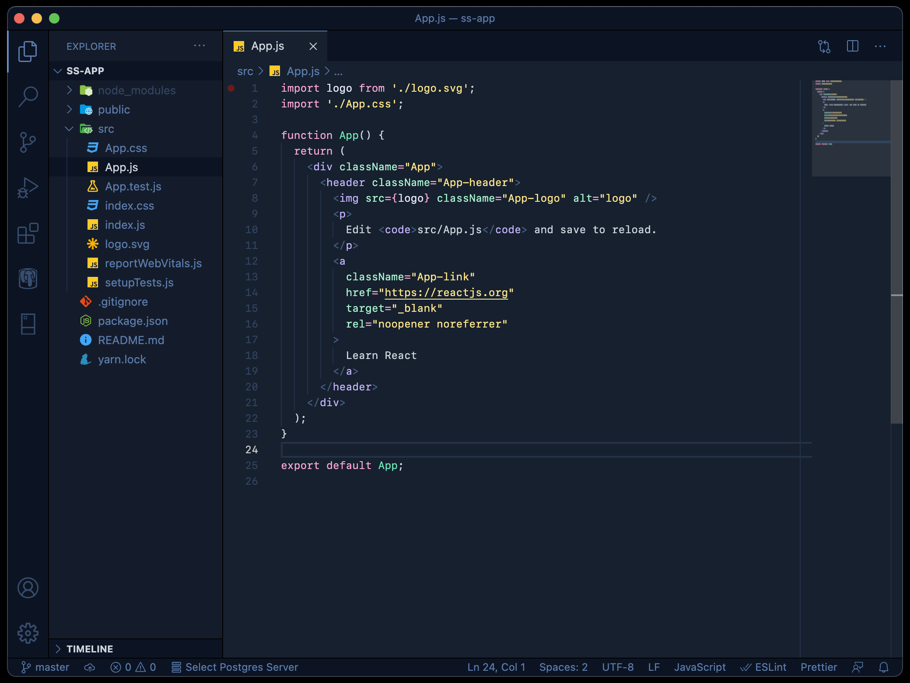

<h1 align="center">Duskwood</h1>

<br />
<p align="center">🌒 A spooky dark theme for coding from dusk till dawn. 🎃🌲🐺</p>
<br />



## 🌲 Development

Clone the project into your Visual Studio Code extensions directory.

```sh
cd .vscode/extensions
git clone https://github.com/gabts/duskwood

cd duskwood
```

Make desired change to theme by editing values in files under the **src** directory.

If editing [theme colors](https://code.visualstudio.com/api/references/theme-color) values it is recommendeed to run `yarn watch`. This script watches the **src** directory for changes and will output changes to a workspace local settings.json which will immediatly update the look of the theme.

This does not work for token colors. When editing tokens you have to run `yarn build` to generate the complete updated theme and then reload the window.

## 🪓 Changelog

Changes are tracked [here](./CHANGELOG).

## 🐺 License

[MIT](./LICENSE)
